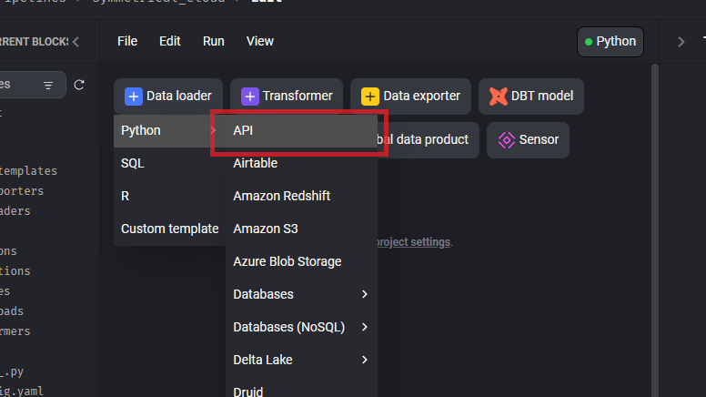

# 從 API 抓取資料

API 的處理方式與 [Oracle 11]一樣使用 Standard (batch) Pipeline 來處理。


## 資料來源

抓取資料選擇 `Data Loader` > `Python` > `API`



然後根據需求撰寫 API 

以下是幾個API的範例

### 送 GET API

```python
import io 
from mage_ai.data_preparation.shared.secrets import get_secret_value
import requests
if 'data_loader' not in globals():
    from mage_ai.data_preparation.decorators import data_loader
if 'test' not in globals():
    from mage_ai.data_preparation.decorators import test


@data_loader
def load_data_from_api(*args, **kwargs):
    """
    Template for loading data from API
    """
    

    url = "https://example.com/api/data"
    resp = requests.get(url, headers=headers)
    
    return resp.json()


@test
def test_output(output, *args) -> None:
    """
    Template code for testing the output of the block.
    """
    assert output is not None, 'The output is undefined'

```

### 送 POST API（沒 body）

```python
# import 省略

@data_loader
def load_data_from_api(*args, **kwargs):
    """
    Template for loading data from API
    """
    
    url = "https://example.com/api/data"
    data = {
        "param1": "value1",
        "param2": "value2"
    }
    resp = requests.post(url, json=data)
    
    return resp.json()


# @test 區塊省略
```

### 使用 OAuth 取 Token + 送 API

```python

import io
import pandas as pd
from mage_ai.data_preparation.shared.secrets import get_secret_value
import requests
if 'data_loader' not in globals():
    from mage_ai.data_preparation.decorators import data_loader
if 'test' not in globals():
    from mage_ai.data_preparation.decorators import test

def load_token(): 
    
    tenant_id = get_secret_value('AZ_TENANT_ID')
    client_id = get_secret_value('AZ_CLIENT_ID')
    client_secret = get_secret_value('AZ_CLIENT_SECRET')

    url = f"https://example.org/api/{tenant_id}/oauth2/token"
    data = {
        "client_id": client_id,
        "client_secret": client_secret,
        "scope": ".default",
        "grant_type": "client_credentials",
    }
    resp = requests.post(url, data = data)

    try:
        resp.raise_for_status()
    except requests.HTTPError:
        print("取得 access token 失敗")
        raise
    
    return resp.json()["access_token"]


@data_loader
def load_data_from_api(*args, **kwargs):
    """
    Template for loading data from API
    """
    token = load_token()

    headers = {
        "Authorization": f"Bearer {token}",
        "Content-type": "application/json",
    }
 
    url = "https://example.org/api/data"

    resp = requests.post(url, headers=headers, json={"foo": "bar"})
    return result
# @test 區塊省略
```


## 匯出資料

匯出資料的部分與 [Oracle 11] 一樣，請參考 [Oracle 11 的《匯出資料》章節](oracle-source-pipeline.md#匯出資料) 。